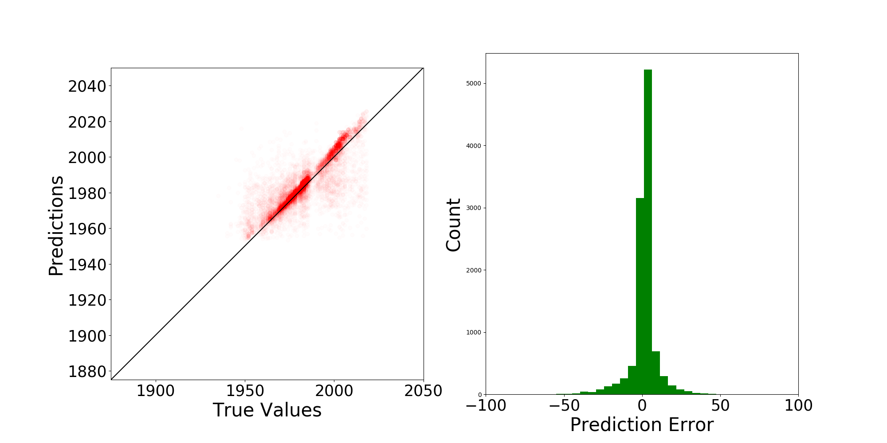

.. _lbl-vnv:

Verification and Validation 
=============================

Anchorage building dataset
---------------------------

This section shows an example in which a neural network is built and trained on the building dataset of Anchorage.
For each building, the location coordinates (longitude, latitude) and year of construction can be found in the dataset.
In this example, 80% of the building were taken for training. The left 20% buildings are used for testing.

.. code-block:: python

    import os
    import wget
    import zipfile
    import shutil   
    import csv
    import numpy as np

    import matplotlib.cm as cm
    import matplotlib.pyplot as plt
    import matplotlib.colors as colors

    #---------------------------------------------------------------------------------------
    # 0. Download data
    #---------------------------------------------------------------------------------------

    url = 'https://berkeley.box.com/shared/static/jbvyu0ng0zrt75il3ps1qygwellpr8c5.zip'
    workDir = 'tmp'
    fileName = 'AnchorageBuildings.zip'
    print('Beginning file download with wget module')
    wget.download(url, fileName)
    print('\nFile downloaded. \n')

    with zipfile.ZipFile(fileName, 'r') as zip_ref:
        zip_ref.extractall('tmp')

    try:
        dest = shutil.move(fileName, workDir+'/') 
    except:
        os.remove(workDir+'/'+fileName)
        dest = shutil.move(fileName, workDir+'/') 

    #---------------------------------------------------------------------------------------
    # 1. Prepare data
    #---------------------------------------------------------------------------------------

    BIMFileName = 'tmp/AnchorageBuildings.csv'

    # read raw data
    data = []
    with open(BIMFileName, newline='') as csvfile:
        reader = csv.DictReader(csvfile)
        for row in reader:
            lat = float(row['Latitude'])
            lon = float(row['Longitude'])
            yearbuilt = int(float(row['Year Built']) )
            if lat>61.05 and lat<61.2 and lon>-150. and lon<-149.7:
                data.append([lon, lat, yearbuilt])

    # data is a numpy matrix with columns: [x,y,value]
    data = np.array(data)

    #---------------------------------------------------------------------------------------
    # 2. Train a neural network
    #---------------------------------------------------------------------------------------
    from surf.NN import SpatialNeuralNet

    # define a spatial neural network
    # numNei is the number of nearest neighbors to be considered
    # writeTmpData is true so that temporary files are written down in ./tmp
    nn = SpatialNeuralNet(rawData = data, numNei = 2, writeTmpData=True)
    nn.build_model()
    nn.train()

    #---------------------------------------------------------------------------------------
    # 3. Test the neural network
    #---------------------------------------------------------------------------------------

    nn.test()

The above example can run locally on your computer if you've installed pySURF.
However, a convenient way to quickly test the example is to run it on Google Colab.
Click `this link  <https://colab.research.google.com/github/NHERI-SimCenter/SURF/blob/master/examples/demo-NN.ipynb>`_ to run on Google Colab.

Upon the complete of the modeling, the prediction errors will be plotted, such as the one shown in 

.. _error_demo:

	Prediction errors for the parameter: year of construction of buildings in Anchorage