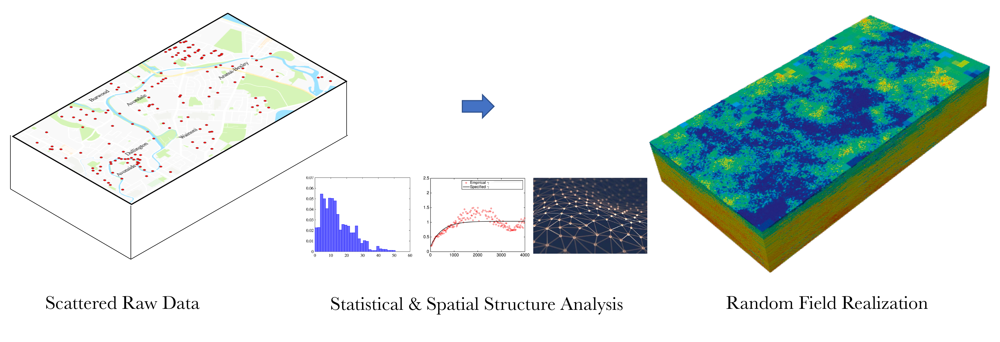

.. s3hark Application documentation master file, created by
   sphinx-quickstart on Mon Dec  9 12:35:25 2019.
   You can adapt this file completely to your liking, but it should at least
   contain the root `toctree` directive.

Spatial Uncertainty Research Framework 
=====================================================================

What is |appName|
---------------------------
SURF is a Python package for performing spatial uncertainty analysis using random fields and machine leaning.

.. toctree::
   :caption: User Manual
   :maxdepth: 1
   :numbered: 2

   
   common/user_manual/installation/installation
   common/user_manual/usage/usage 
   common/license

.. _lbl-technical-manual:

.. toctree::
   :caption: Technical Manual
   :maxdepth: 1
   :numbered: 2

   common/technical_manual/theory

.. _lbl-developer-manual:

.. toctree::
   :caption: Developer Manual
   :maxdepth: 2
   :numbered: 2

   common/developer_manual/dev

How to cite
---------------------------

Charles Wang. (2019, September 28). NHERI-SimCenter/SURF: v0.2.0 (Version v0.2.0). Zenodo. http://doi.org/10.5281/zenodo.3463676

License
---------------------------

The |surfName| application is distributed under the BSD 3-Clause license, see :ref:`lbl-license` for details.

Acknowledgement
---------------------------

This material is based upon work supported by the National Science Foundation under Grant No. 1612843. 
Any opinions, findings, and conclusions or recommendations expressed in this material are those of the authors and do 
not necessarily reflect the views of the National Science Foundation.

Contact
---------------------------
Charles Wang, NHERI SimCenter, University of California, Berkeley, c_w@berkeley.edu